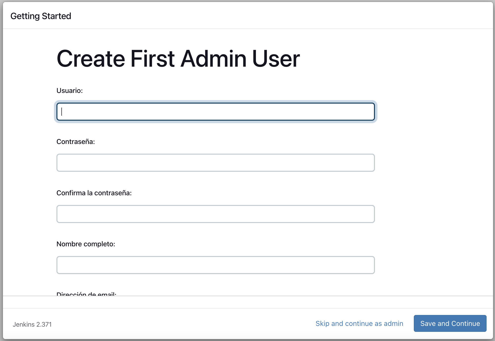

## **Task 3**

Solución a la tarea de instalación de JENKINS

## **Resumen entrega**

1. Archivo bash con menú instalación: ['installJenkins.sh'][2]
2. Archivo de JJB con el job: ['firstjob.yaml'][4]
3. Archivo configuración de jenkins por JCAC: ['jenkins.yaml'][3]
4. Definición del pipeline: ['Jenkinsfile'][8]

# **SOLUCION DE LA TAREA**

Se seleccionó la tarea asociada a JENKINS para ser implementada.

Se utilizó VAGRANT como proveedor de la VM donde se realizo la instalación y configuración de Jenkins.
La VM esta definida en el archivo ['Vagrantfile'][1]

### **Punto 1, 2 y 3**

Se realizó un script (['installJenkins.sh'][2]) en bash que resuelve la instalación de Jenkins y sus dependencias.

El script es aprovisionado en la VM y se debe ejecutar de forma manual.


### **Punto 4,5 y 6**

Una vez instalado Jenkins y todas sus dependencias, plugins, etc. debemos considerar:

1. Configuración de Jenkins mediante el plugin JCAC (Jenkins Configuration As Code)
2. Creación del job que define el pipeline para el deploy de la app en node mediante el plugin JJB (Jenkins Job Builder)

### JCAC

Este plugin sirve para configurar como código la mayoria de las partes de jenkins.
En nuestro caso se configuraron opciones básica de permisos y se definió un nuevo usuario.

La definición se puede apreciar en el archivo ['jenkins.yaml'][3]

### JJB

Para la creación del JOB con el pipeline necesario se utilizó otro plugin de jenkins.
En el archivo ['firstjob.yaml'][4] se puede ver la definición.

También tenemos el archivo ['jenkins_jobs.ini'][5]. Archivo que se utiliza para definir la configuración del plugin.

Ambos archivo se encuentran dentro de la carpeta 'pipeline'.

## Paso a paso

A continuación se define los paso a dar para poder probar todos los puntos del ejercicio.

### 1 - Levantar la VM con vagrant

Parados en el directorio donde se encuentra el archivo Vagrantfile ejecutar el siguiente comando:

```bash
vagrant up
```

Una vez que la VM haya levantado ejecutar el siguiente comando para ingresar por ssh:

A continuación se levantarán las 2 vm que van a ser utilizadas para el cluster

```bash
vagrant ssh
```

### 2 - Instalación de dependencias

Para instalar las dependencias, una vez dentro de la VM debemos ejecutar:

```bash
./installJenkins.sh
```

A continuación se deplegará el siguiente menú en la consola:


A continuación ejecutar los puntos;

1. Insalar JAVA
2. Instalar Docker
3. Instalar JJB
4. Instalar Jenkins

Una vez ejecutado el punto 4, podremos acceder al servidor de jenkins a través de la siguiente url:

[http://localhost:8080](http://localhost:8080)

**Para poder continuar con la instalación debemos acceder obligatoriamente a la url anterior en el navegador**


El password que se solicita se obtiene de ejecutar el punto 5 del menú de instalación:


A continuación se deve copiar esa clave y pegar en el browser.

A continuación se deplegará la siguiente pantalla:


**Se debe seleccionar la opción "Install Suggested Plugins"**

EL proceso de instalación demora unos minutos.

Al finalizar la instalación de los plugins se va a desplegar la siguiente pantalla:



**Clickear en el botón "Skip and continue as admin".**

Finalmente nos muestra una pantalla donde nos sugiere la URL a utilizar por el server.


Dejar la URL que se parecia en la imagen y hacer click en el botón "Save and Finish".

**!!! Ya podemos comenzar a utilizar JENKINS !!!!**


### Continuar instalando pluigns

Para poder continuar con la instalación de dependencias (Resta la instalación de los plugins) debemos hacer lo siguiente.

1. Ir a la configuración del usuario:


2. Generar un token para APIs:


**Recordar copiar el token ya que lo vamos a necesitar y una vez que se salga de la pantalla ya no se será accesible**

Una vez copiado el token lo vamos a pegar en el archivo ['credentials'][6] del repositorio.

EL contenido del archivo debera ser estructurado de la siguiente forma:

usuario:token_copiado

Una vez actualizado el archivo credentials debemos volver a provisionar la VM:

```bash
#Si ya estamos en la consola de la VM debemos hacer logout
logout
#Provisionamos nuevamente
vagrant provision
#Volvermos a acceder a la VM
vagrant ssh
```

Podemos verificar que el contenido del archivo credentials se haya actualizado correctamente:

```bash
cat credentials
```

Finalmente ejecutamos nuevament el menú de instalación:

```bash
./installJenkins.sh
```

Ejecutamos la opción 6:

6. Instalar plugins JCAC, DOCKER, DOCKER-WF desde la cli


Ejemplo:

```bash
admin:1161c9c7a105145d1330cce22d9ed54412
```

Para terminar, en el navegador debemos volver a loguearnos nuevamente (al instlar los plugins se reinicia el server) y aplicar la configuración de JCAC que queremos utilizar. (Recordar que el punto 5 del menú nos da la contraseña del usuario admin para poder loguearnos).

1. Ir al menú "Administrar Jenkins"


2. Ir a la opción "Configuration as code"


3. Tipear el PATH del archivo JCAC y confirmar


Si todo salió correctamente, cuando volvamos a la pantall principal deberíamos ver lo siguiente:


**Jenkins configurado por plugin JCAC**


**Hemos finalizado la configuración de Jenkins**

### 3 - Deploy del job utilizando JJB

Solo nos resta hacer el deploy del job para poder probar el pipeline.

Antes de continuar vamos a hacer logout de la app y vamos a ingresar con las siguientes credenciales:

user: jlarrayoz
password: jlarrayoz

_Este usuario fue creado por JCAC en los pasos anteriores_

Necesitamos crear un API token para este usuario. Repetir los siguiente pasos (ya lo habiamos relizado para el suuario admin):

1. Ir a la configuración del usuario:


2. Generar un token para APIs:


**Recordar copiar el token ya que lo vamos a necesitar y una vez que se salga de la pantalla ya no se será accesible**

Editar el archivo ['jenkins_jobs.ini'][7] en la carpeta 'pipeline' y modificar la linea password. Poner el token generado.

Una vez actualizado el archivo debemos volver a provisionar la VM:

```bash
#Si ya estamos en la consola de la VM debemos hacer logout
logout
#Provisionamos nuevamente
vagrant provision
#Volvermos a acceder a la VM
vagrant ssh
```

Para deployar el job debemos ejecutar en la VM la siguiente linea de comandos parados en el directorio HOME/pipeline

```bash
#Para asegurarmos que estamos en el dir correcto
cd $HOME/pipeline
#Agregar el job
sudo jenkins-jobs --conf jenkins_jobs.ini -l info  update firstjob.yaml
```

Si todo salio correctamente en la consola vamos a ver algo como esto:

```bash
INFO:jenkins_jobs.cli.subcommand.update:Updating jobs in ['firstjob.yaml'] ([])
WARNING:jenkins_jobs.modules.scm:git:'clean: bool' configuration format is deprecated, please use the extension style format to configure this option.
INFO:jenkins_jobs.builder:Number of jobs generated:  1
INFO:jenkins_jobs.builder:Creating jenkins job my-first-pipeline
INFO:jenkins_jobs.cli.subcommand.update:Number of jobs updated: 1
INFO:jenkins_jobs.builder:Number of views generated:  0
INFO:jenkins_jobs.cli.subcommand.update:Number of views updated: 0
```

Si vamos a la home de jenkins en el navegador vamos a poder visualizar el job:


En el siguiente video podemos apreciar el pipeline funcionando:

[Video pipeline funcionando](https://drive.google.com/file/d/1Bu0-LvqR8VnfqDdtjTvsYpbx6WXbP4Fo/view?usp=sharing)


El pipeline esta configurado para hacer clone de un fork del repo de git dado en la tarea. En ese repo se encuentra el archivo ['Jenkinsfile'][8] que detalla la configuración de los diferentes stages, etc.

```yaml
pipeline {
    environment {
        NPM_CONFIG_CACHE = "${WORKSPACE}/.npm"
    }
    agent {
        docker {
            image 'node:6-alpine' 
            args '-p 3000:3000' 
        }
    }
    stages {
        stage('Build') { 
            steps {
                sh 'npm install' 
            }
        }
        stage('Deliver') { 
            steps {
                sh "chmod +x -R ${env.WORKSPACE}"
                sh 'sh deliver.sh' 
                input message: 'Termino de usar la app? (Click "Proceed" para continuar)' 
                sh 'sh kill.sh' 
            }
        }        
    }
}
```

El pipeline esta compuesto por 2 stages:

1. Build: hace el build en un contenedor docker de la app de node de ejemplo
2. Deliver: Levanta la app en el contendor docker y la expone en el puerto 3000. La app queda accesible desde el browser del usuario para que se pueda probar.

_En un escenario real, este stage en realidad termina haciendo el deploy a la nube, o al server de producción donde deba ir la app._

[1]: Vagrantfile
[2]: installJenkins.sh
[3]: jenkins.yaml
[4]: pipeline/firstjob.yaml
[5]: pipeline/jenkins_jobs.ini
[6]: credentials
[7]: pipeline/jenkins_jobs.ini
[8]: https://github.com/jlarrayoz/node-hello/blob/master/Jenkinsfile

<br/>
<br/>
<br/>


## Links de referencia

Material sobre JCAC

https://www.eficode.com/blog/start-jenkins-config-as-code
https://github.com/Praqma/praqma-jenkins-casc
https://plugins.jenkins.io/configuration-as-code/

Como instalar plugins desde la cli

https://www.jenkins.io/doc/book/managing/plugins/#install-with-cli

Jenkins job builder

https://jenkins-job-builder.readthedocs.io/en/latest/quick-start.html
