# **Task 4 - Cloud AWS**

 

## Contenido
1. [QwikLabs I](#lab1)
    1. [Conclusión](#lab1_1)
2. [QwikLabs II](#lab2)

 

## QwikLabs "Cloud I" 

**Objetivo:** Build VPC, S3, EC2 and RDS Products with AWS Service Catalog

**Descripción:** El laboratorio consta de 9 tareas. A continuación se muestra captura con las tareas que lo componenen:

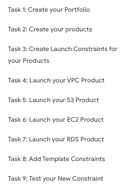

 

#### **Task 1**

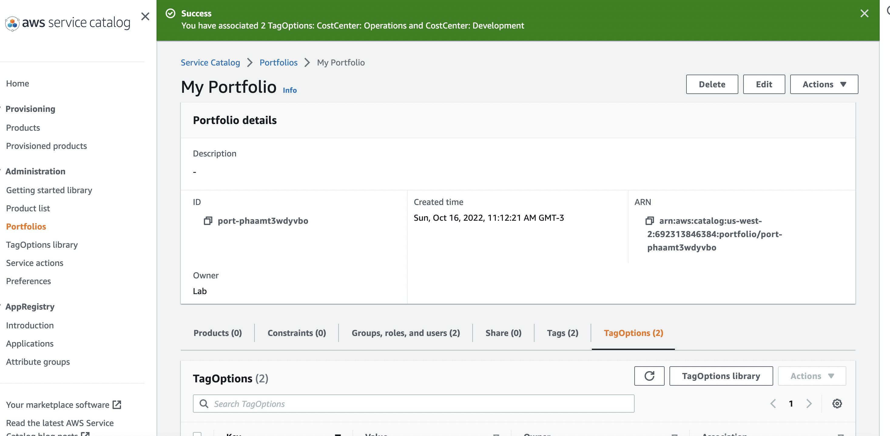

 

#### **Task 2**

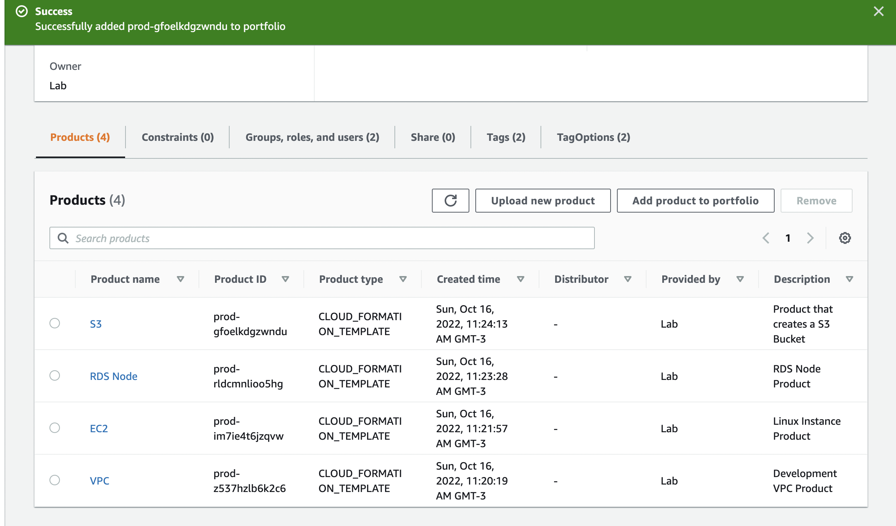

 

#### **Task 3**

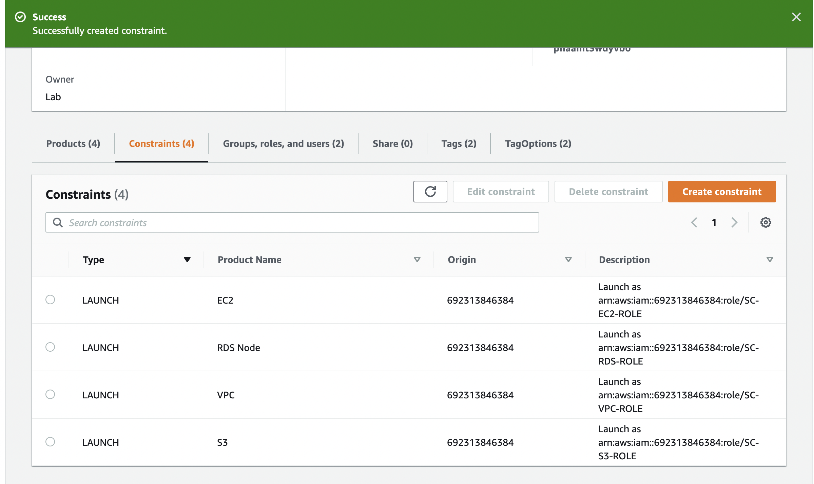

 

#### **Task 4**

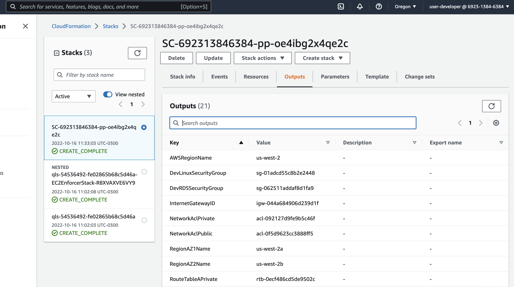

 

#### **Task 5**

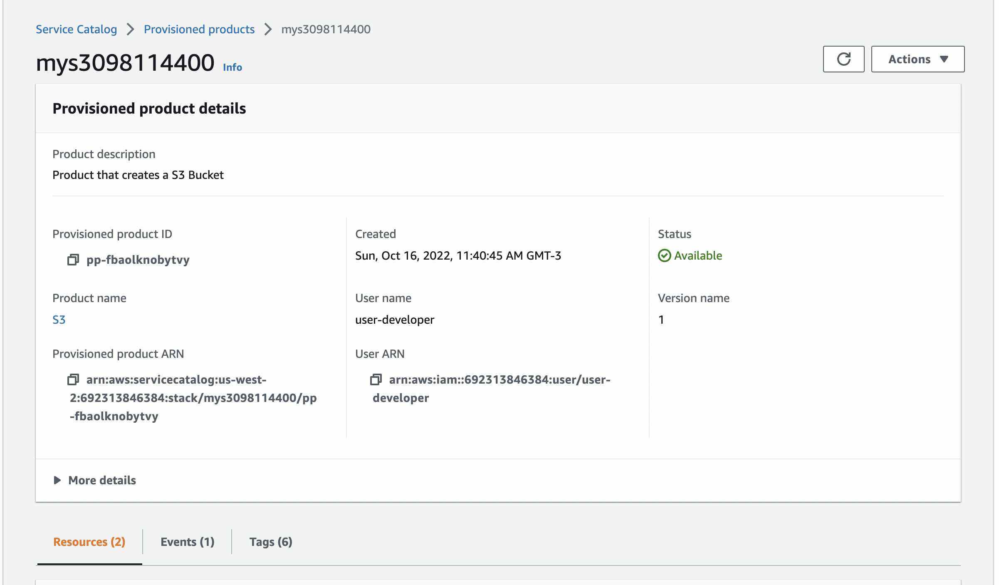

 

#### **Task 6**

 

#### **Task 7**

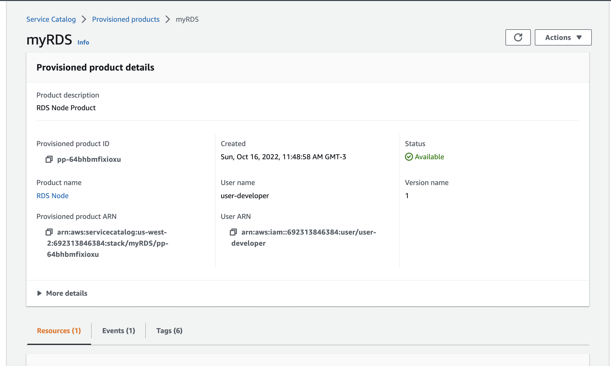

 

#### **Task 8**

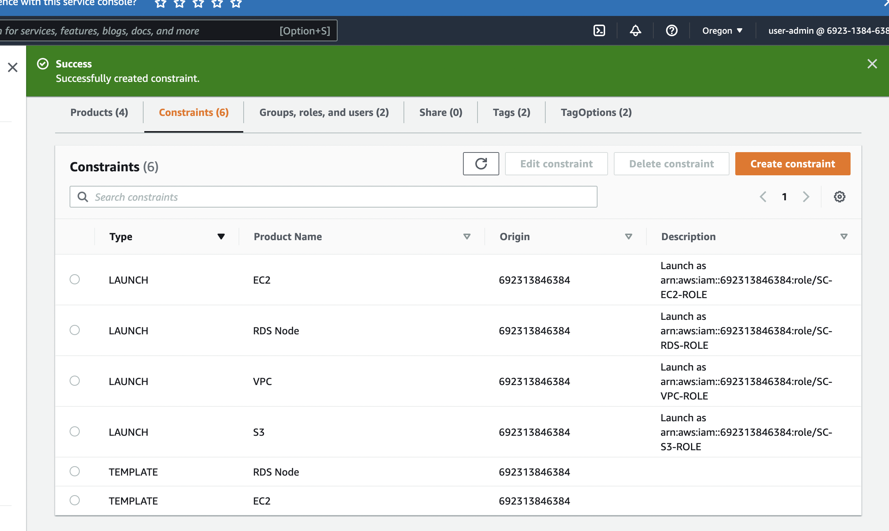

 

#### **Task 9**

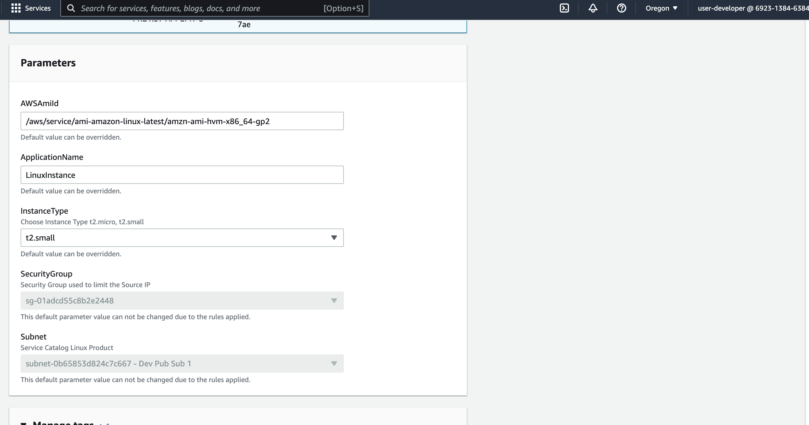

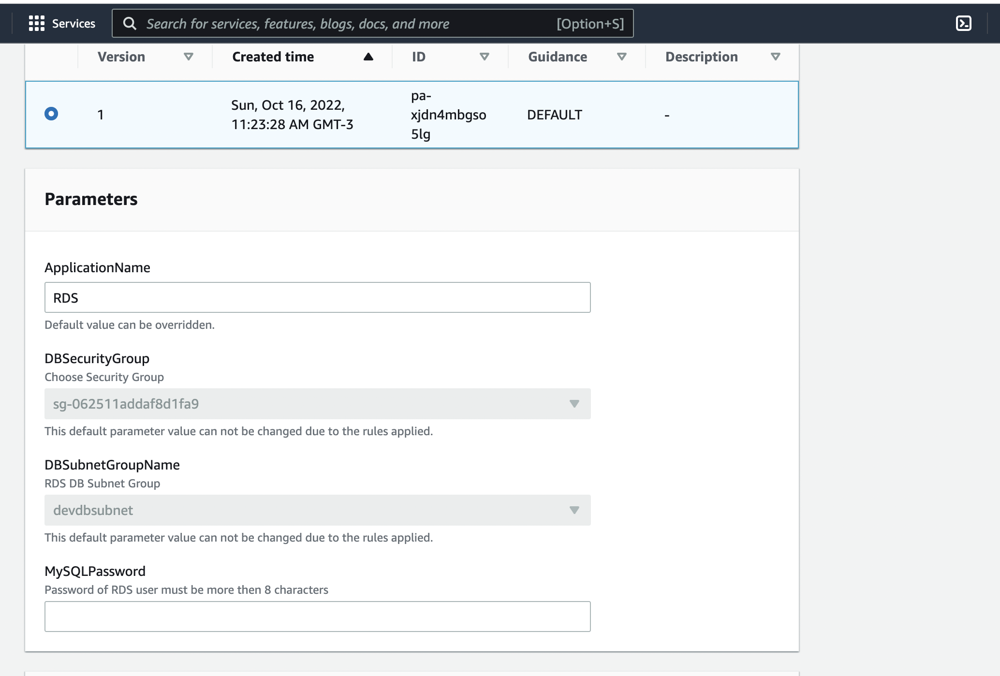

 

#### **Lab terminado**

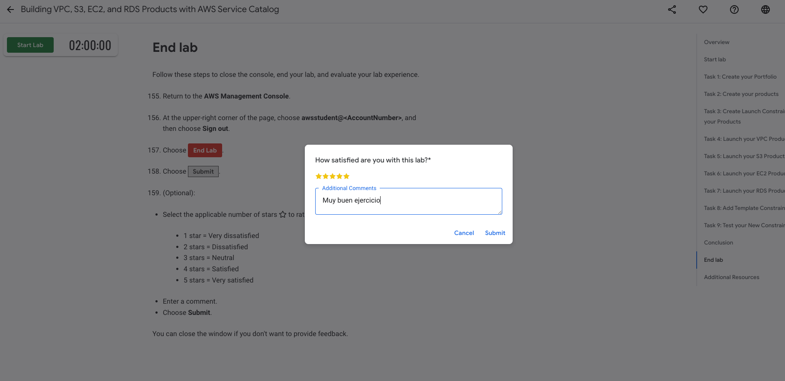

 

_Constancia de avance_

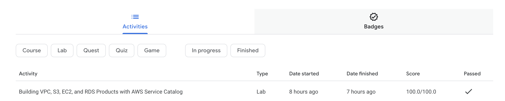

 

#### **Conclusión**

El contenido del laboratorio es correcto, la explicación paso a paso de AWS es detallada y si se sigue al pie de la letra se puede completar el lab sin mayores problemas.

Al ser contrareloj, no te permite profundizar mientras haces el labs en diferentes conceptos que se van presentando y no tenía claros.

Al levantar la configuración por ejemplo de la VPC de un template, se desconoce en detalle todo lo que ya viene configurado por defecto, y como dije anteriormente, el tiempo no te permite profundizar en detalle en la configuración por miedo a que no te de para terminar en tiempo y forma.

Me quede con varios conceptos que se tocan en el taller anotados para profundizarlos, sobre todo lo que tiene que ver con IAM, ya que la parte de seguirdad la vimos muy por arriba en el curso.

En resumen, buen lab, que muestra como aplicar varios de los conceptos básicos vistos en el curso.

 

## QwikLabs "Cloud II"

UNDER CONSTRUCTION
