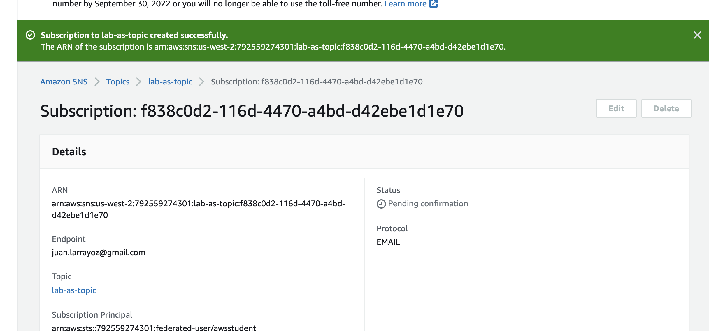
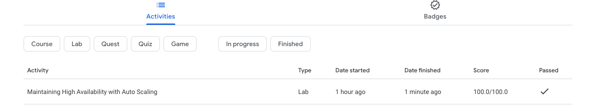

# **Task 4 - Cloud AWS**

 

## Contenido
1. [QwikLabs I](#lab1)
    1. [Conclusión](#lab1_1)
2. [QwikLabs II](#lab2)
    1. [Conclusión](#lab2_1)

 

## QwikLabs "Cloud I" 

**Objetivo:** Build VPC, S3, EC2 and RDS Products with AWS Service Catalog

**Descripción:** El laboratorio consta de 9 tareas. A continuación se muestra captura con las tareas que lo componenen:

 

#### **Task 1**

 

#### **Task 2**

 

#### **Task 3**

 

#### **Task 4**

 

#### **Task 5**

 

#### **Task 6**

 

#### **Task 7**

 

#### **Task 8**

 

#### **Task 9**

 

#### **Lab terminado**

 

_Constancia de avance_

 

#### **Conclusión**

El contenido del laboratorio es correcto, la explicación paso a paso de AWS es detallada y si se sigue al pie de la letra se puede completar el lab sin mayores problemas.

Al ser contrareloj, no te permite profundizar mientras haces el labs en diferentes conceptos que se van presentando y no tenía claros.

Al levantar la configuración por ejemplo de la VPC de un template, se desconoce en detalle todo lo que ya viene configurado por defecto, y como dije anteriormente, el tiempo no te permite profundizar en detalle en la configuración por miedo a que no te de para terminar en tiempo y forma.

Me quede con varios conceptos que se tocan en el taller anotados para profundizarlos, sobre todo lo que tiene que ver con IAM, ya que la parte de seguirdad la vimos muy por arriba en el curso.

En resumen, buen lab, que muestra como aplicar varios de los conceptos básicos vistos en el curso.

 

## QwikLabs "Cloud II"

**Objetivo:** Maintaining High Availability with Auto Scaling

**Descripción:** El laboratorio consta de varios pasos (no están separados en tareas como el lab I) A continuación se muestra captura de los pasos que lo componenen:

 

#### **Connect to EC2 and Configure AWS CLI**

 

#### **Create Launch Configuration and Auto Scaling Group**

_Creación por consola de "Launch Configuration"_

_Creación por consola de "Auto Scaling Group"_

_Validación de las instancias_

_Server funcionando_

A continuación terminamos instanicas y verificamos que se volvieran a crear. También lo hicimos parando instancias.

 

#### **Create Auto Scaling Notifications**

Primero creamos una topic utilizando el servicio SNS, luego creamos un subscriber y lo configuramos para que nos notificara por mail.

 

#### **Create Policies and alarms**

Se crean 2 policies:
1. Scale up policiy: Cuando el % de consumo de CPU >= 40 se suma una instancia
2. Scale down policy: Cuando el % de consumo de CPU baja de 20% se resta una instancia

_Scale UP Policy_

_Scale DOWN Policy_

Se crean 2 alarmas asociadas a las policies definidas anteriormente:

_Alarm High CPU usage_

_Alarm Low CPU usage_

 

#### **Test auto scaling**

Para probar todo lo creado anteriormente, entramos desde el browser a a la URL del loadbalancer y le pedimos que generara carga:

Se pudo apreciar el siguiente camdio de estado en las alarmas:

En la captura se puede apreciar que al generar carga se dispara la alarma de HIGH CPU y su estado cambia a "In alarm".

En la siguiente captura podemos apreciar como se creo una instancia y luego cuando la carga bajo del 20% esa instancia fue "terminada"

Acorde a lo configurado, al mail llegaron las siguientes notificaciones:

 

#### **Lab terminado**

 

_Constancia de avance_

#### **Conclusión**

El contenido del laboratorio es correcto, la explicación paso a paso de AWS es detallada y si se sigue al pie de la letra se puede completar el lab sin mayores problemas.

Al ser contrareloj, no te permite profundizar mientras haces el labs en diferentes conceptos que se van presentando y no tenía claros.

Los comandos que terminé ejecutando por consola, si bien son entendibles una vez que se los analiza en detalle, a priori parecen "magia negra" :)

Me reslultó muy interesante el tema, he trabajando con balanceo de carga sobre Kubernetes y docker (utilizando Nginx por ejemplo), AWS lo tiene muy bien resuelto.

En resumen, buen lab, que muestra como aplicar varios de los conceptos básicos vistos en el curso.

