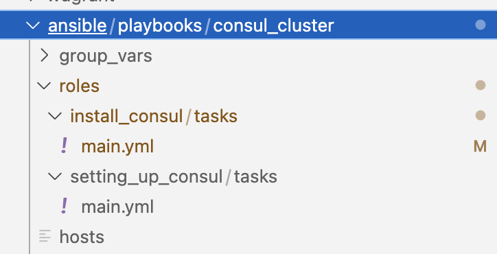
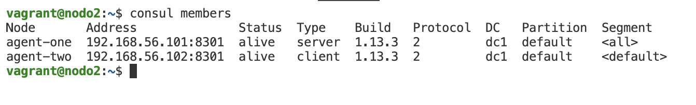
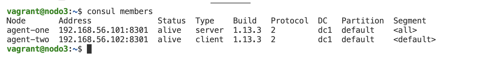

# **Task 6**

Solución a la tarea de Service Discovery and Configuration Management


<br/>

## Contenido
1. [Video de la tarea funcionando](https://drive.google.com/file/d/1V3-oGOI6soCA9lfgmBuhGdY2Yc-HQUYX/view?usp=sharing)
2. [Creación de las VM con Vagrant](#vagrant)
3. [Aprovisionando con Ansible](#ansible)
4. [Inventory de ansible](#inventory)
5. [Ejecutar la tarea](#runtask)

<div id='vagrant'>

<br/>

## Creación de las VM con Vagrant

Se utilizó Vagrant para la creación de las 3 instancias necesarias para resolver la tarea:

1. nodo1: Ansible Master
2. nodo2: Consul server
3. nodo3: Consul client

El archivo **_['Vagrantfile'][1]_** contiene la creación de las 3 VM.

Se utilizó vagrant para realizar la instalación de ansible en el nodo1.
A continuación se puede apreciar un extracto del script sh:

```bash
#!/usr/bin/env bash

#Instalacion de ansible en ubuntu 18.04
sudo apt-add-repository -y ppa:ansible/ansible
sudo apt update
sudo apt install -y ansible

...

```

Este es el archivo **_[bootstrap_nodo1.sh][2]_** completo.

</div>

<div id='ansible'>

<br/>

## Aprovisionando con ansible

Para aprovisionar el nodo2 (Consul server) y el nodo3 (Consul client) se utilizo una playbook de ansible.

En la siguiente imagen podemos ver la estructura de la playbook.



La playbook se encuentra en el directorio: 

- **_[ansible/playbooks/consul_cluster][3]_**

La playbook esta compuesta por 2 roles:

- **install_consul:** Rol encargado de la instalación del package de consul en los 2 nodos

- **setting_up_consul:** Rol encargado de levantar consul server en el nodo2 y consul client en el nodo3

### Rol install_consul

Este rol ejecuta las siguientes tareas:

```yaml
---

#Creamos un directorio temporal donde se van a guardar los archivos que se van a descargar mas adelante
- name: Creates aux dir
  file:
    path: /home/vagrant/tmp
    state: directory  

#Bajamos las keys del repo de consul
- name: download repo keys
  ansible.builtin.shell:
    cmd: wget -O- https://apt.releases.hashicorp.com/gpg | gpg --dearmor | sudo tee /usr/share/keyrings/hashicorp-archive-keyring.gpg
    chdir: /home/vagrant/tmp

#Agregamos el repo de consul
- name: add repo keys
  ansible.builtin.shell:
    cmd: echo "deb [signed-by=/usr/share/keyrings/hashicorp-archive-keyring.gpg] https://apt.releases.hashicorp.com $(lsb_release -cs) main" | sudo tee /etc/apt/sources.list.d/hashicorp.list

#Se hace un sudo apt-get update
#el become: true hace que se ejecute el comando como sudo
- name: Update apt packages
  become: true
  apt:
    update_cache: yes
    cache_valid_time: 86400 

#Se instala el package de consul (sudo apt-get install consul)
#el become: true hace que se ejecute el comando como sudo
- name: Install consul package
  become: true
  ansible.builtin.apt:
    name: consul
    state: present
```

### Rol setting_up_consul

Este rol ejecuta las siguientes tareas:

```yaml
---

#Ejecuta consul como server unicamente en el nodo2
#El when se utiliza para limitar en que server se corre la tarea
- name: Run server
  when: inventory_hostname in groups['consul_server']
  ansible.builtin.shell:
    cmd: nohup consul agent -server -bootstrap-expect=1 -node=agent-one -bind=192.168.56.101 -data-dir=/tmp/consul -config-dir=/etc/consul.d & > /dev/null

#Ejecuta consul como cliente unicamente en el nodo3
#El when se utiliza para limitar en que server se corre la tarea
- name: Run client
  when: inventory_hostname in groups['consul_client']
  ansible.builtin.shell:
    cmd: nohup consul agent -node=agent-two -bind=192.168.56.102 -enable-script-checks=true -data-dir=/tmp/consul -config-dir=/etc/consul.d & > /dev/null

#Hace el join del cliente instalado en el nodo3 al server que esta corriendo en el nodo2
#El when se utiliza para limitar en que server se corre la tarea
- name: Join client
  when: inventory_hostname in groups['consul_client']
  ansible.builtin.shell:
    cmd: consul join 192.168.56.101
```

</div>

<div id='inventory'>

<br/>

## Ansible inventory

El inventory (inventario) de ansible define los host a ser aprovisionados por ansible.

En nuestro caso definimos el inventory en el archivo **_[hosts][4]_**. 

A continuación podemos ver el contenido del arhcivo:

```yaml
consul_server:
  hosts:
    nodo2:
      ansible_host: 192.168.56.101
consul_client:  
  hosts:  
    nodo3:
      ansible_host: 192.168.56.102
```

En este caso se definen 2 hosts (2 de las VM creadas con vagrant) como parte del inventario.

<div/>

<div id='runtask'>

<br/>

## Ejecutar tarea

Para ejecutar la tarea y ver todo lo mencionado anteriormente funcionando debemos ejecutar los siguientes pasos:

### Levantar vagrant

Parados en el directorio donde se encuentra el archivo Vagrantfile ejecutar:

```bash
vagrant up
```

### Entrar por ssh al nodo1

Una vez que vagrant termino de levantar las 3 vm vamos a entrar por ssh al nodo1 (Ansible Master):

```bash
vagrant ssh nodo1
```

### Ejecutar la playbook consul_cluster

Una vez dentro del nodo1 nos vamos a encontrar en el directorio /home/vagrant

A continuación ejecutar los siguiente comandos:

```bash
cd ansible/playbooks/consuk_cluster
```

Ahora estamos parados en el directorio donde se encuentra la playbook.

Para ejecutar la playbook:

```bash
ansible-playbook -i hosts site.yml
```

el param -i instruye a ansible que utilice el inventory definido en el archivo hosts.

el archivo site.yml contiene la lista de Plays a ejecutar:

```yaml
---

#Esta play se ejecuta en localhost (Ansible Master o nodo1)
#Agrega los nodos 2 y 3 al archivo know_hosts del nodo1 para poder conectarse por ssh sin inconvenientes
- hosts: localhost
  connection: local
  tasks:
    - { debug: { msg: "Esta tarea corre local" } }  
    - name: add repo keys
      ansible.builtin.shell:
        cmd: ssh-keyscan -H 192.168.56.101 >> ~/.ssh/known_hosts && ssh-keyscan -H 192.168.56.102 >> ~/.ssh/known_hosts

#Play encargada de ejecutar los roles que installan y levantan consul en el nodo 2 y 3
- hosts: all
  roles:
    - install_consul
    - setting_up_consul  
```

### Mostrar la conformación del cluster

Ahora vamos a ejecutar el comando "consul members" en el nodo2 (Consul server) y en el nodo3 (Consul client).

Desde el nodo1 vamos a entrar por ssh al nodo2 (192.168.56.101)

```bash
ssh 192.168.56.101
```

Luego ejecutamos el comando:

```bash
consul members
```

Debemos ver la siguiente salida:




Para ver la salida del client debemos volver al nodo1 ejecutando el siguiente comando:

```bash
exit
```

Luego conectamos por ssh al nodo3 (Consul client):

```bash
ssh 192.168.56.102
```

Luego ejecutamos el comando:

```bash
consul members
```

Debemos ver la siguiente salida:



**Se recomienda ver el video "[Video de la tarea funcionando](https://drive.google.com/file/d/1V3-oGOI6soCA9lfgmBuhGdY2Yc-HQUYX/view?usp=sharing)" para ver la tarea funcionando con el paso a paso que de describe.**


[1]: Vagrantfile
[2]: config_nodos/nodo1/bootstrap_nodo1.sh
[3]: ansible/playbooks/consul_cluster
[4]: ansible/playbooks/consul_cluster/hosts